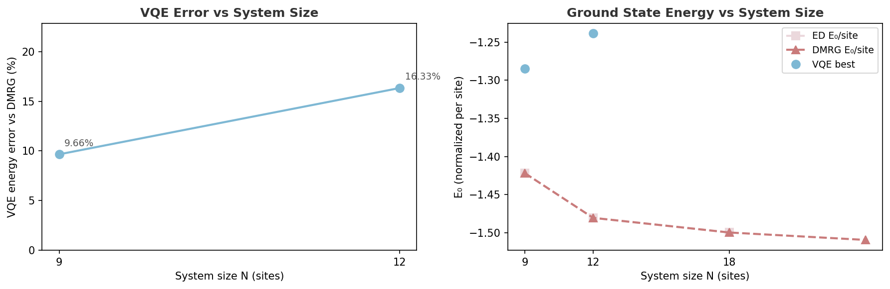
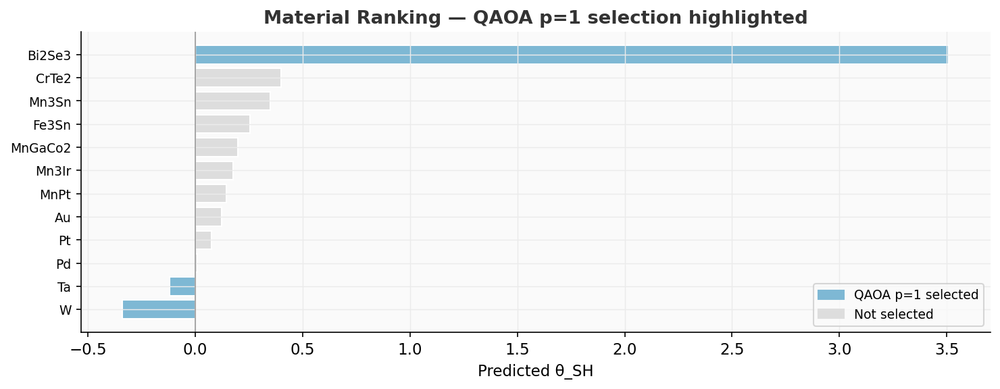
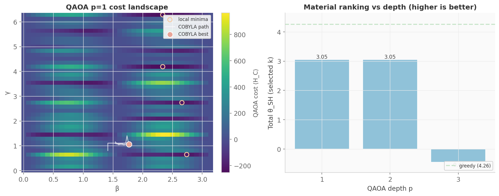

<div align="center">


**Variational Quantum Simulation of Antiferromagnetic Hamiltonians**

Part of [ARPA Quantum Logical Systems — QONDRA](https://github.com/arpaqls) &nbsp;·&nbsp; [qondra@arpacorp.net](mailto:qondra@arpacorp.net)

<br>


[](LICENSE)


[](https://doi.org/10.5281/zenodo.XXXXXXX)


</div>

---

## What this is

`spinq-vqe` simulates the quantum many-body physics of **Mn₃Sn** — a Kagome antiferromagnet that demonstrated 40-picosecond spin-orbit torque switching (UTokyo, 2026). We use Variational Quantum Eigensolvers (VQE) to approximate its ground state and compare directly to spectroscopic data.

Two parallel research threads:

- **VQE on the Kagome lattice**: ground-state energy, entanglement structure, barren plateau diagnostics, exact diagonalization benchmarks.
- **SOC material screening via QAOA**: classical MLP surrogate on spin Hall angle data, used as oracle for a QAOA composition optimizer.

## Structure

```
spinq-vqe/
├── src/spinq_vqe/
│   ├── kagome.py        # Kagome lattice graph + Heisenberg Hamiltonian
│   ├── ansatz.py        # HVA, HEA, MERA variational ansatze
│   ├── vqe.py           # COBYLA (primary) + Adam (diagnostic) VQE runners
│   ├── entanglement.py  # Von Neumann entropy, mutual information
│   ├── utils.py         # Publication-quality plot helpers
│   ├── surrogate.py     # MLP surrogate for spin Hall angle prediction
│   └── qaoa.py          # QAOA circuit + optimizer for material selection
├── notebooks/           # Executable research notebooks
├── figures/             # Generated plots
├── data/                # ED/VQE/QAOA CSVs, mp_theta_sh.csv, statevectors
├── scripts/             # fetch_mp_theta_sh.py — refresh MP dataset (optional)
├── docs/                # Guides and API reference → docs/README.md
├── OVERVIEW.md          # Full program description + research context
└── REFERENCES.md        # Full bibliography (50+ references)
```

## Install

```bash
python -m venv .venv
.venv\Scripts\activate        # Windows
source .venv/bin/activate     # Linux / macOS
pip install -e ".[dev]"
```

**Conda users:**
```bash
conda env create -f environment.yml
conda activate spinq-vqe
```

Requires Python ≥ 3.11. Core: `pennylane ≥ 0.39`, `numpy`, `scipy`, `networkx`, `matplotlib`.  
Optional: `pip install -e ".[data]"` adds `scikit-learn`, `mp-api`, `pandas` (for SOC QAOA notebooks).

**SOC QAOA data (NB04):** uses committed `data/mp_theta_sh.csv` (no API key needed). To refresh from Materials Project:

```bash
cp .env.example .env          # add MP_API_KEY from materialsproject.org/api
pip install -e ".[data]"
python scripts/fetch_mp_theta_sh.py
```

## Notebooks

| # | Notebook | Notes |
|---|----------|-------|
| 01 | [`01_kagome_hamiltonian.ipynb`](notebooks/01_kagome_hamiltonian.ipynb) | lattice, ED baseline, figures |
| 02 | [`02_vqe_run.ipynb`](notebooks/02_vqe_run.ipynb) | COBYLA seed stats (mean ± std), 9.66% best error, Adam barren plateau |
| 03 | [`03_entanglement.ipynb`](notebooks/03_entanglement.ipynb) | entropy profile, MI matrix, sublattice correlations |
| 04 | [`04_soc_qaoa.ipynb`](notebooks/04_soc_qaoa.ipynb) | surrogate MLP, QAOA p=1/2/3, material ranking, landscape diagnostic |
| 05 | [`05_scaling_analysis.ipynb`](notebooks/05_scaling_analysis.ipynb) | N=9/12/18 scaling, gradient variance, barren plateau |

## Key results

### Ground-state energy (VQE vs exact diagonalisation)

| N | Seeds | Mean E₀ | Std E₀ | Best E₀ | Error (best) | Notes |
|---|-------|---------|--------|---------|--------------|-------|
| 9 | 5 | −1.23572 | 0.02852 | **−1.28456** | **9.66%** | HEA d=3, 27 params |
| 12 | 3 | −1.21520 | 0.02026 | −1.23859 | 16.33% | HEA d=2, 24 params |
| 9 | — | — | — | −1.42190399 | — | Exact diag., gap Δ ≈ 0 |
| 18 | — | — | — | −1.49962859 | — | Exact diag., gap Δ = 0.037 |

Adam / HEA d=3 at N=9 stalls at +0.141 (barren plateau). COBYLA mean ± std and per-seed
distributions are in `data/vqe_results.csv`, `data/vqe_seeds_n9.csv`, and
`figures/vqe_seed_distribution.png` (regenerate via NB02).

**Why COBYLA, not Adam:** The `|0⟩⊗N` initial state is a Z-basis eigenstate — all IsingXX/YY/ZZ gradients cancel to exactly zero by SU(2) symmetry. COBYLA uses function evaluations directly and is immune to this.

<table>
<tr>
<td></td>
<td></td>
</tr>
</table>

### Entanglement structure (N=9 statevector)

| Metric | Value | Interpretation |
|--------|-------|----------------|
| Mean single-site entropy | **0.9066 bits** | Near-maximal → strong quantum fluctuations |
| Max single-site entropy | **1.000 bits** | 7 of 9 sites maximally entangled |
| Sublattice I(A:B) | **3.689 bits** | Strong inter-sublattice correlations |
| Sublattice I(A:C), I(B:C) | **2.235 bits** | C sublattice also correlated |
| Mean pairwise MI | **0.227 bits** | Non-local correlations (spin liquid signature) |


### SOC material selection via QAOA

| Method | Total θ_SH | Selected | Notes |
|--------|-----------|----------|-------|
| QAOA p=1 | 3.049 | W, Ta, Bi₂Se₃ | Best QAOA depth — still sub-optimal |
| QAOA p=2 | 3.049 | W, Ta, Bi₂Se₃ | Same selection as p=1 |
| QAOA p=3 | −0.451 | W, Ta, Pd | Deeper circuit — worse on this oracle |
| **Greedy (classical)** | **4.259** | **Bi₂Se₃, CrTe₂, Mn₃Sn** | Optimal on surrogate oracle |
| Sim. annealing | 4.259 | Mn₃Sn, CrTe₂, Bi₂Se₃ | Matches greedy |





## Tests

```bash
pip install -e ".[dev]"
pytest tests/ -v
```

Six test modules covering all library functions. Runs in under 90 seconds on CPU. See [`docs/testing.md`](docs/testing.md) for the full guide.

## Docs

→ [`OVERVIEW.md`](OVERVIEW.md) — research narrative, key results, and literature context.  
→ [`docs/README.md`](docs/README.md) — physics background, ansatz guide, API reference, notebook guide.  
→ [`docs/testing.md`](docs/testing.md) — test suite guide, coverage map, extending tests.

## References

See [`REFERENCES.md`](REFERENCES.md) for the full bibliography.  
Key: Sachdev (1992), Yan/Huse/White (2011), Wiersema et al. (2020), Kandala et al. (2017), Cerezo et al. (2021), Farhi et al. (2014).

## Citation

If you use this software, please cite [`CITATION.cff`](CITATION.cff):

> Peilivanidis, V., & ARPA Quantum Logical Systems (QONDRA). (2026). *spinq-vqe: Variational Quantum Simulation of Antiferromagnetic Hamiltonians* (v0.1.3). https://github.com/ARPAQLS/spinq-vqe

After Zenodo archival, replace the DOI badge placeholder above with the **concept DOI** (stable link to the latest archived version). Prefer citing the software DOI for the code artifact; cite the paper DOI separately once the manuscript is published.

---

**License:** MIT &nbsp;·&nbsp; **Contact:** [qondra@arpacorp.net](mailto:qondra@arpacorp.net)
